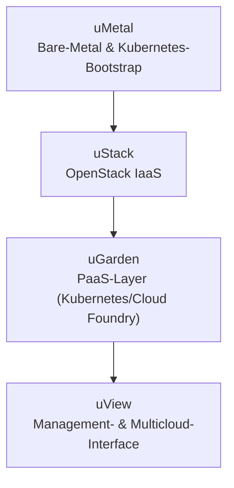
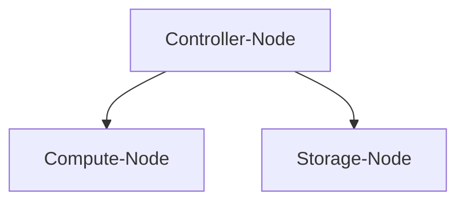
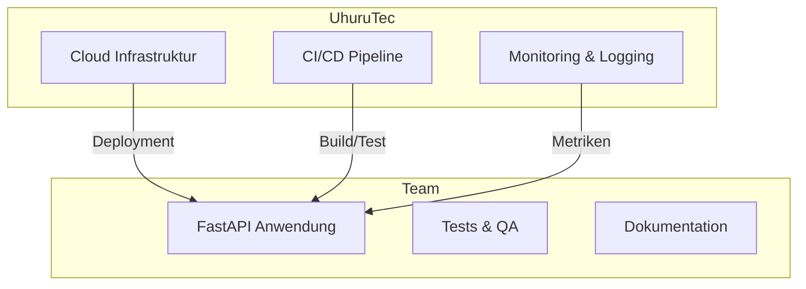
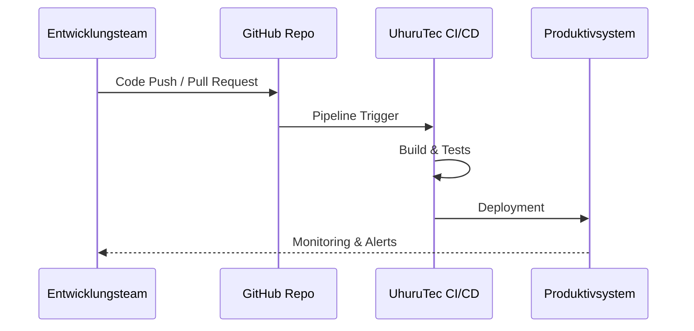

# Kooperation mit UhuruTec AG (Stuttgart)

Die UhuruTec AG positioniert ihre Cloud-Plattform als offen, kosteneffizient und frei von proprietären Zwängen. Laut Whitepaper basiert das gesamte Ökosystem auf Open‑Source‑Technologie, wodurch keine Lizenz- oder versteckten Kosten anfallen und ein Lock‑in‑Effekt wie bei klassischen Hyperscalern vermieden wird. Kernversprechen sind:

- **>20 % Kosteneinsparung** gegenüber Hyperscalern
- **100 % Ersparnis** bei Lizenzkosten für die Plattform
- **Freiheit & Flexibilität:** Hardwarewahl und offene Standards ermöglichen barrierefreie Integration
- **Made in Germany:** Daten können auf eigener Hardware und in frei wählbaren Rechenzentrumsstandorten verbleiben

## Produkt-Ökosystem

Die Plattform lässt sich vereinfacht als Baum darstellen: vom Bare-Metal bis zur Managementoberfläche bauen die Module aufeinander auf.

- **uMetal:** Automatisierte Installation der Server inkl. Linux, Container-Runtime und Kubernetes – Basis für kritische Infrastrukturen
- **uStack:** Mit Kubernetes-Operatoren verwaltete OpenStack-Cloud als IaaS-Layer (Compute, Networking, Storage, DBaaS)
- **uGarden:** PaaS-Schicht, die per GitOps und Cluster-API schnell neue Kubernetes-Plattformen bereitstellt
- **uView:** Benutzer- und Abrechnungsportal samt Multicloud-Management

Ergänzend bietet UhuruTec Support- und Servicepakete (uSupport, uService) für Betrieb und Wartung.

## Rollen und Verantwortlichkeiten

| Partner        | Aufgabenbereich |
|---------------|-----------------|
| **UhuruTec AG** | - Bereitstellung und Betrieb der Infrastruktur (Cloud- bzw. Server-Hosting) - Einrichtung von CI/CD-Pipelines, Monitoring und Security - Pflege von Datenbanken und ggf. Message-Brokern |
| **Entwicklungsteam** | - Implementierung der Fachlogik (FastAPI, Business-Logik, Tests) - Pflege von Docker-Konfiguration und Build-/Deploy-Skripten - Dokumentation und Qualitätssicherung |

## Technische Aufteilung

- **Code-Repository:** GitHub mit Pull-Request-Workflow, Linting und Tests
- **Container-Images:** Docker mit Multi-Stage-Builds, Security-Updates und Secrets-Management
- **Deployment:** Automatisiertes Ausrollen via Render/Fly.io o. Ä.
- **Monitoring & Logging:** Zentralisierte Lösung (z. B. Prometheus/Loki, Datadog) inkl. Alerting

## Projektablauf laut Whitepaper

Der Lebenszyklus einer Zusammenarbeit wird in drei Phasen beschrieben:

1. **Kick-Start (1–3 Monate):** Erstgespräch, Briefing, Beratung und Budgetplanung
2. **Go Live:** Implementierung, Übergabe und Monitoring
3. **Operations (> 5 Jahre):** 24/7‑Wartung, enge Betreuung und regelmäßiges Reporting

Ansprechpartner laut Whitepaper: **Heiko Krämer** (Tel. +49 175 599 8378, heiko.kraemer@uhurutec.com)

## uStack Architektur (Whitepaper)

## Beispielhafte Architektur

## Beispielhafter CI/CD-Ablauf

## Offene Punkte / To-do

- Prüfen, ob UhuruTec spezielle Produkte oder SLAs anbietet, sobald verlässliche Informationen vorliegen.
- Details zur Kostenstruktur und Support-Verfügbarkeit klären.
- Abstimmung der genauen CI/CD- und Monitoring-Tools nach Rückmeldung von UhuruTec.

